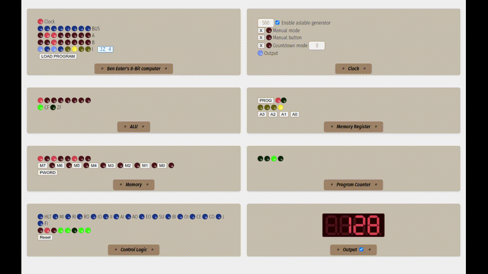

# Ben Eater's 8-Bit Computer

Ben Eater's computer in Vue2. Works with node@v16.



For more information about the reference implementation of the computer, check out [Ben Eater's homepage](https://beneater.net/8bit).

## Project Setup

```sh
npm install
```

### Compile and Hot-Reload for Development

```sh
npm run dev
```

### Compile and Minify for Production

```sh
npm run build
```

### Lint with [ESLint](https://eslint.org/)

```sh
npm run lint
```


